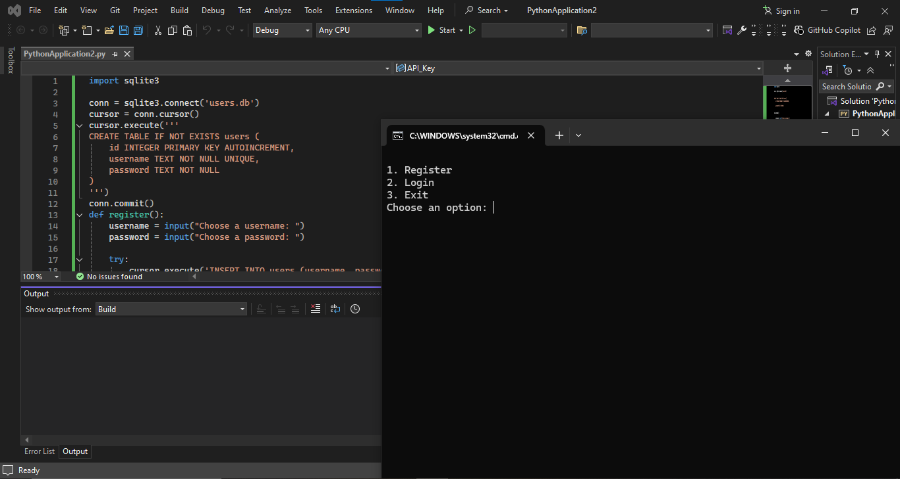

# ✨ Simple Python Login System with SQLite

A basic Python project that allows user registration and login using SQLite as the database.

---

## 📌 Features

- Register new users with username and password
- Login with authentication
- Store user data in SQLite database
- Prevent duplicate usernames during registration

---

## ⚙️ Requirements

- Python 3.x
- `sqlite3` module (built-in with Python)

---

## 🚀 How to Run

1. Clone the repository:
   ```bash
   git clone https://github.com/mohammads132s2s3/Simple-python-login-system-with-database.git
   cd Simple-python-login-system-with-database
   ```

2. Run the program:
   ```bash
   python sqlite3.py
   ```

3. You will see the following menu:
   ```
   1. Register
   2. Login
   3. Exit
   ```
---
##📸 Screenshot

<=Screenshot=>
---

## 📁 File Structure

- `sqlite3.py`: Main script containing the login and registration logic.

---

## 🤝 Contributing

Feel free to submit issues or pull requests to improve the project!
